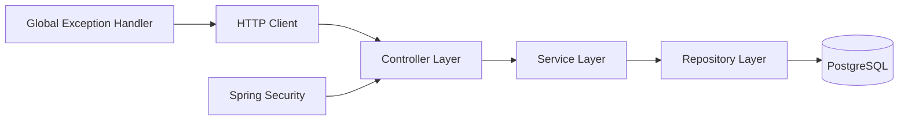

# License Key Market

A backend REST API for a digital license marketplace built with **Java 21**, **Spring Boot**, **Spring Security**, **Spring Data JPA**, and **PostgreSQL**.

The application manages users, digital products, subscription plans, purchases, upgrades, and generated license keys. The project focuses on clean layered architecture, DTO-based API contracts, validation, transactional business logic, and consistent error handling.


## Features

- User registration with password hashing
- Session-based login and logout with Spring Security
- Current-user profile endpoint
- User management
- Product CRUD operations
- Multiple subscription plans per product
- Supported plan periods: `ONE_WEEK`, `ONE_MONTH`, `THREE_MONTHS`
- Purchase and upgrade flow for subscriptions
- Prevention of same-level or lower-level upgrades while a subscription is active
- Automatic license-key generation
- Transactional purchase processing
- Pessimistic locking during purchases to reduce concurrent update conflicts
- Request validation with Jakarta Validation
- DTO-based request and response models
- Centralized REST exception handling
- PostgreSQL persistence through Spring Data JPA

## Tech Stack

| Technology | Purpose |
| --- | --- |
| Java 21 | Application language |
| Spring Boot 4.1.1 | Application framework |
| Spring MVC | REST API |
| Spring Security | Authentication and password encoding |
| Spring Data JPA / Hibernate | Persistence layer |
| PostgreSQL | Relational database |
| Jakarta Validation | Request validation |
| Lombok | Boilerplate reduction |
| Maven | Build and dependency management |

## Architecture

The application follows a classic layered backend architecture:



Main package structure:

```text
src/main/java/com/nvrsocial/market
├── component
│   └── KeyGenerator
├── config
│   └── SecurityConfig
├── controller
│   ├── AuthController
│   ├── ProductController
│   ├── ProfileController
│   ├── SubscriptionController
│   └── UserController
├── dto
│   ├── request
│   └── response
├── entity
│   └── enums
├── exception
├── repository
└── service
```

## Domain Model

The main domain entities are:

- `User` — application user
- `Product` — digital product
- `ProductPlan` — purchasable plan for a product
- `Subscription` — user's subscription to a product
- `ProductKey` — generated license key connected to a subscription

A user can purchase a product plan. The resulting subscription stores its start and expiration dates, and a license key is generated for it.

For active subscriptions, a user can only move to a higher plan level. Purchasing the same or a lower active plan is rejected.

## Business Rules

The service layer enforces several domain rules:

- a user cannot purchase the same or a lower plan while a subscription is active;
- one subscription is maintained for a user/product pair;
- upgrading a subscription updates its plan and validity period;
- a new license key is generated after a purchase or upgrade;
- a purchased plan cannot have its period changed;
- a purchased plan cannot be removed from a product;
- a product with existing subscriptions cannot be deleted;
- a user with existing subscriptions cannot be deleted.

## API Overview

### Authentication

| Method | Endpoint | Description |
| --- | --- | --- |
| `POST` | `/api/auth/register` | Register a user |
| `POST` | `/api/auth/login` | Log in and create a session |
| `POST` | `/api/auth/logout` | Log out and invalidate the session |
| `GET` | `/api/me` | Get the currently authenticated user |

The login endpoint is handled by Spring Security form login and expects `application/x-www-form-urlencoded` parameters:

```text
username=your_username
password=your_password
```

### Users

| Method | Endpoint | Description |
| --- | --- | --- |
| `GET` | `/api/users` | Get all users |
| `GET` | `/api/users/{id}` | Get user by ID |
| `PUT` | `/api/users/{id}` | Update user |
| `DELETE` | `/api/users/{id}` | Delete user |

### Products

| Method | Endpoint | Description |
| --- | --- | --- |
| `GET` | `/api/products` | Get all products |
| `GET` | `/api/products/{id}` | Get product by ID |
| `POST` | `/api/products` | Create product |
| `PUT` | `/api/products/{id}` | Update product and its plans |
| `DELETE` | `/api/products/{id}` | Delete product |

Example product request:

```json
{
  "name": "Example Product",
  "description": "Digital product with subscription plans",
  "productPlans": [
    {
      "productPeriod": "ONE_WEEK",
      "price": 4.99
    },
    {
      "productPeriod": "ONE_MONTH",
      "price": 12.99
    }
  ]
}
```

### Subscriptions

| Method | Endpoint | Description |
| --- | --- | --- |
| `POST` | `/api/subscriptions/buy` | Purchase or upgrade a subscription |

Example request:

```json
{
  "userId": 1,
  "planId": 2
}
```

A successful response contains information about the subscription, selected plan, expiration date, active state, and generated license key.

## Validation and Error Handling

Incoming DTOs are validated before reaching the service layer.

Validation errors, malformed request bodies, missing resources, conflicts, unsupported methods, and unexpected server errors are converted into a consistent API error format.

Example:

```json
{
  "timestamp": "2026-10-07T18:00:00Z",
  "status": 400,
  "message": "Validation failed",
  "path": "/api/auth/register",
  "fields": {
    "username": "must match \"[a-zA-Z0-9_-]{3,32}\""
  }
}
```

## Getting Started

### Requirements

- Java 21
- PostgreSQL
- Git

The repository includes the Maven Wrapper, so installing Maven globally is optional.

### 1. Clone the repository

```bash
git clone https://github.com/nvrsocial/license-key-market.git
cd license-key-market
```

### 2. Create the database

Create a PostgreSQL database:

```sql
CREATE DATABASE "key-market";
```

### 3. Configure the application

`src/main/resources/application.properties` is intentionally excluded from Git.

Create it locally:

```properties
spring.datasource.url=${DB_URL:jdbc:postgresql://localhost:5432/key-market}
spring.datasource.username=${DB_USERNAME:postgres}
spring.datasource.password=${DB_PASSWORD:postgres}

spring.jpa.hibernate.ddl-auto=update
spring.jpa.show-sql=true

server.error.include-stacktrace=never
server.error.include-message=always
server.error.include-binding-errors=never
```

You can either change the default values or provide the `DB_URL`, `DB_USERNAME`, and `DB_PASSWORD` environment variables.

### 4. Run the application

Linux/macOS:

```bash
./mvnw spring-boot:run
```

Windows:

```powershell
mvnw.cmd spring-boot:run
```

The API will be available at:

```text
http://localhost:8080
```

